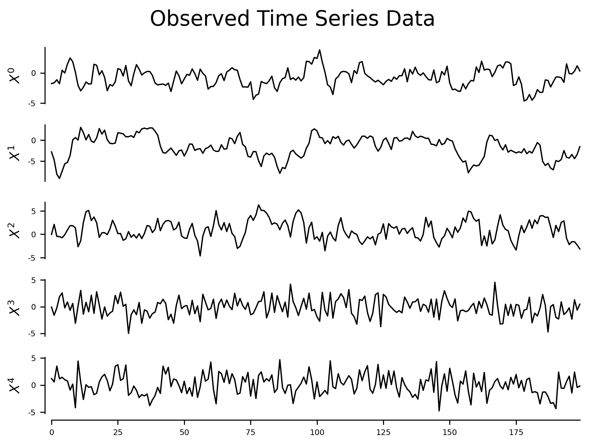
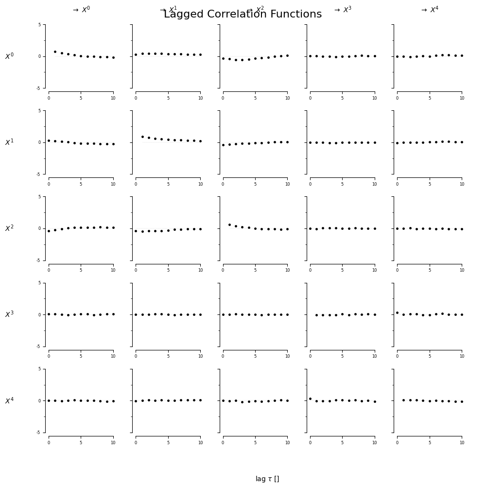
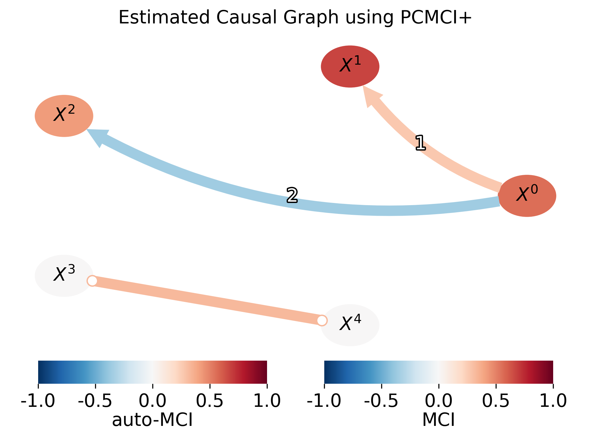
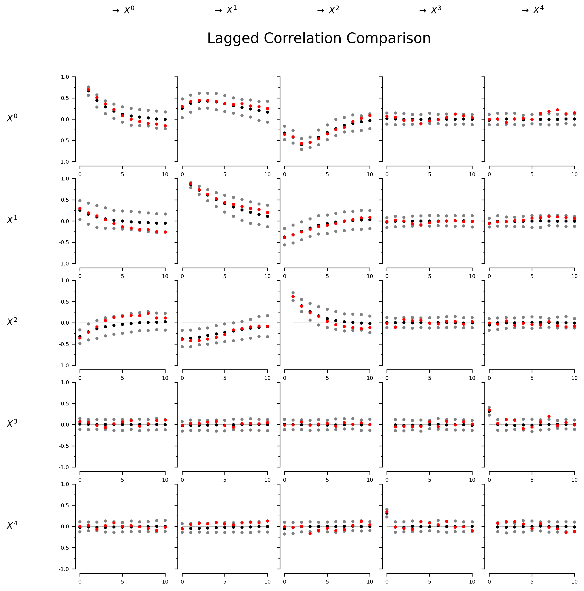
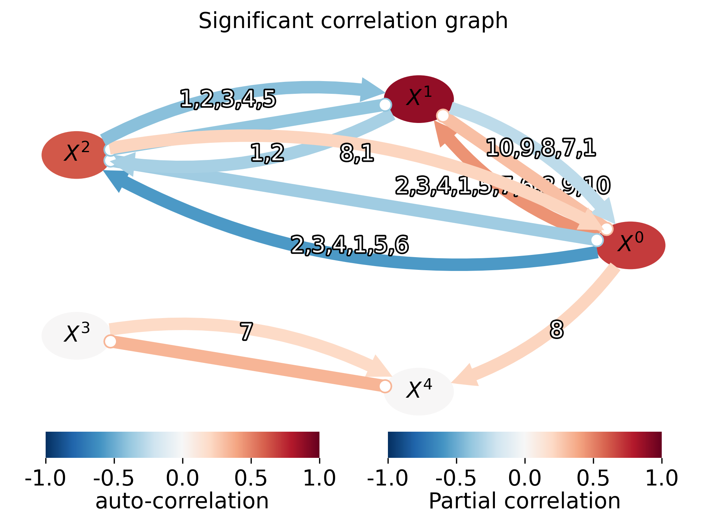

# GNN-Causal-Inference

```
GNN-Causal-Inference/
├── Module/
│   ├── PCMCI-val.py            # PCMCI验证模块(含时间序列生成、因果图估计等)
│   ├── PCMCI.py                # 主PCMCI实现模块(处理真实数据)
│   ├── SCMI.py                 # 空间因果互信息算法实现
│   ├── pcmci_results.py        # PCMCI结果可视化模块
│   └── PCMCI/                  # 结果输出目录
├── dataset/
│   ├── TJ/                     # 天津数据集
│   │   ├── TJ_position.csv     # 节点位置数据
│   │   └── sampled_tensor_data_tem.npy  # 采样数据
│   └── Intel Lab Data/         # Intel实验室数据
│       ├── re/                 # 预处理数据
│       ├── other/              # 其他数据
│       ├── dataprocess/        # 数据处理
│       └── timestamps_process/ # 时间戳处理
└── utils/
    └── haversine_distance.py   # 地理距离计算工具

```

## 核心模块说明

### 1. PCMCI-val.py
验证PCMCI算法的模块，包含：
- 合成时间序列生成
- 滞后相关性分析
- 因果图估计与可视化
- 代理数据生成与比较

### 2. PCMCI.py
主PCMCI实现模块：
- 读取真实时空数据
- 基于地理距离的链接假设
- 运行PCMCI+算法
- 生成网络因果图和矩阵热力图

### 3. SCMI.py
空间因果互信息算法：
- 节点特征提取(时间序列聚合)
- 空间关联图构建
- 全局Moran's I计算
- 离散化数据处理
- 因果图生成

### 4. pcmci_results.py
PCMCI结果可视化模块：
- 因果图网络可视化
- 节点/边统计信息
- 因果矩阵热力图生成

## 数据集
- **TJ数据集**：天津地区时空数据
- **Intel Lab Data**：Intel实验室传感器数据

# 实验报告

## 实验1：PCMCI+算法验证

> 参考：
>
> - https://hekai.blog.csdn.net/
> - https://github.com/jakobrunge/tigramite/blob/master/tutorials/benchmarking_and_validation/tigramite_tutorial_explaining_correlations.ipynb

对比分析PCMCI+算法生成的因果图和显著相关图

1. 数据合成：根据$X_t = \alpha \cdot Y_{t-1} + \beta \cdot Z_{t-2} + \epsilon_t$ 预设因果关系，并添加噪声，生成合成时间序列数据；  

   

2. 计算滞后相关函数

   观察变量之间是否存在时间延迟上的相关性,确实符合预设的因果关系

   

3. PCMCI+学习因果图：从观测数据中识别出：哪些变量对另一个变量有直接的滞后影响，这些影响是正向还是负向的（通过 MCI 数值判断）  

   

4. 构建显著相关图用于对比     

   1）生成代理数据集：基于原始数据和已知因果结构，生成多个替代数据集（具有类似的统计特性、不同的随机噪声实现、“无因果”的参考分布）

   2）对比原始相关性和代理数据的相关性，判断其是否显著

   > 相关性成因：
   >
   > - 真实的因果关系；
   >
   > - 样本量有限或噪声引起的伪相关性）

   

   > 黑色线：替代数据的平均相关性
   > 灰色区域：90%置信区间
   > 红色线：原始数据的相关性

   若原始相关性绝对值超出随机情况→存在真实的因果关系，否则表明原始数据中的相关性可能是随机波动的结果。

   

   筛选P值绘制显著相关图，显著相关图包含相关但非因果的边，但是显著性高的边确实为真是因果关系，PCMCI+算法的因果学习结果基本正确                           

